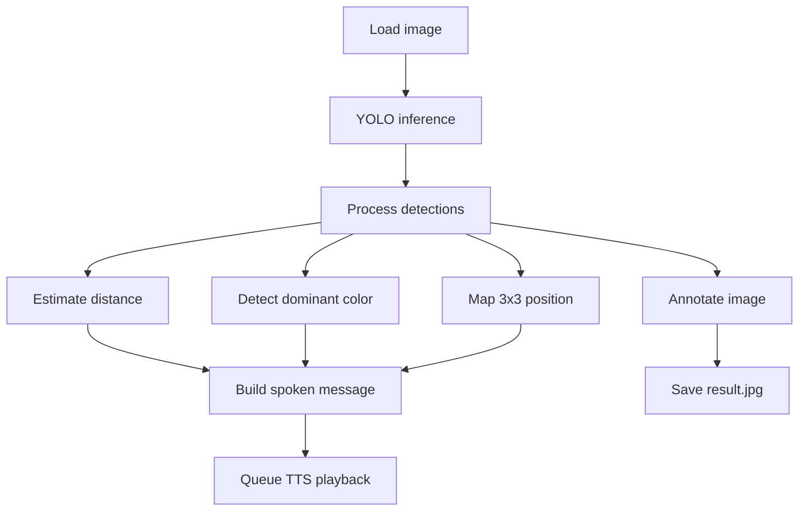

# Object Recognition TTS

A still-image assistive pipeline that detects objects with YOLO, estimates distance and color, maps positions on a 3x3 grid, and speaks a concise description for each object.

## What it does
- Runs YOLO detection on a single image
- Estimates distance from bounding box width
- Detects dominant color per object
- Maps object position to a 3x3 grid phrase
- Speaks a message for every eligible object

## Project layout
- [main.py](main.py): entry point for still-image inference and TTS
- [distance_color_pipeline.py](distance_color_pipeline.py): post-process detections and annotate output
- [distance_color_utils.py](distance_color_utils.py): distance and color utilities
- [position_mapper.py](position_mapper.py): 3x3 grid mapping and labels
- [tts_speaker.py](tts_speaker.py): background TTS queue and playback
- [final.pt](final.pt): trained YOLO weights
- [object-detection.ipynb](object-detection.ipynb): training and dataset workflow (optional)

## Quick start
1. Install dependencies
   - Python 3.9+
   - `pip install ultralytics opencv-python pyttsx3 numpy`
2. Run with the default image
   - `python main.py`
3. Run with a custom image
   - `python main.py path\\to\\your_image.jpg`

## Inputs and outputs
- Input image: configured in [main.py](main.py) as `IMAGE_PATH` or passed via CLI
- Output image: saved as `result.jpg` in the project folder
- Spoken output: queued TTS messages describing each object

## Workflow diagram

## Notes
- Only objects within `ANNOUNCE_DIST_M` are spoken.
- The TTS engine runs in a background thread and plays messages sequentially.
- Adjust `CONF_THRESH` and `IOU_THRESH` in [main.py](main.py) to tune detection.

## Troubleshooting
- If no audio plays, confirm your system TTS voices are available and not muted.
- If an object is skipped, check its estimated distance and the announce threshold.
- If an image fails to load, confirm the path and file extension.
